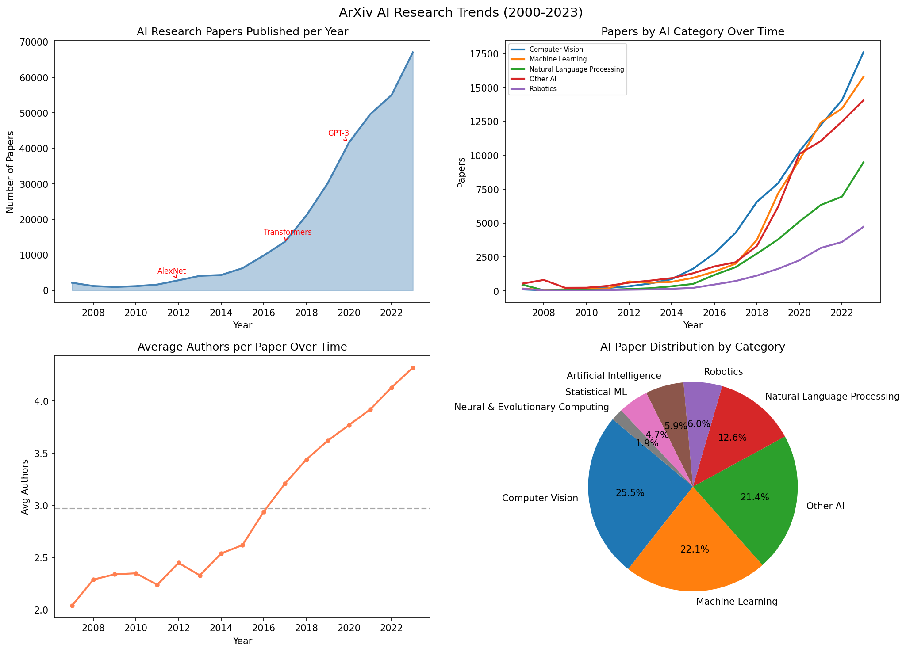
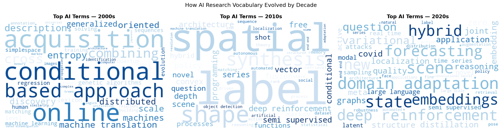

# AI Research Trends Dashboard

AI research has exploded over the last two decades but most people only see
the headlines — AlexNet, Transformers, ChatGPT. This project digs into the
actual data: 312,925 papers published on ArXiv between 2007 and 2023,
analyzed and visualized in an interactive dashboard.

---

## The Problem

The growth of AI research is well known but poorly understood at a granular
level. Which fields grew fastest? When did collaboration become the norm?
How did the vocabulary of AI shift from "neural network" to "transformer"
to "large language model"? The raw ArXiv data exists but it takes a proper
pipeline to turn it into answers.

---

## What I Built

An end-to-end data pipeline and interactive Streamlit dashboard that:
- Streams and filters 2M+ ArXiv records to extract 312K AI papers
- Cleans, enriches, and aggregates data by year, category, and collaboration
- Generates word clouds showing how AI terminology evolved by decade
- Serves everything through an interactive dashboard with live filters

---

## The Impact

| Metric | Value |
|---|---|
| Papers analyzed | 312,925 |
| Year range | 2007 – 2023 |
| Fastest growing year | 2023 |
| Most active field | Computer Vision (79,832 papers) |
| Avg authors per paper | 3.78 |
| Collaborative papers | 78.9% |

Key findings:
- Computer Vision is the largest AI subfield with 79,832 papers
- Average team size grew from ~2 authors in 2007 to ~4.5 in 2023
- NLP papers spiked sharply after 2017 — the year Transformers were introduced
- ChatGPT's launch in 2022 coincided with the highest single-year paper growth

---

## Live Dashboard

🔗 [View the live dashboard here](https://ai-research-trends.streamlit.app/)

---

## Dataset

ArXiv Research Papers — Cornell University via Kaggle

- 2M+ total papers across all fields
- Filtered to 7 AI/ML categories: cs.AI, cs.LG, cs.CL, cs.CV, cs.NE, cs.RO, stat.ML
- [Download here](https://www.kaggle.com/datasets/Cornell-University/arxiv)

---

## Project Structure
```
ai-research-trends-dashboard/
│
├── data/raw/                  → arxiv JSON file (not uploaded to GitHub)
├── data/processed/            → cleaned CSVs for dashboard
├── outputs/
│   ├── research_trends.png    → static overview chart
│   └── decade_wordclouds.png  → word clouds by decade
├── main.py                    → data pipeline (run this first)
├── dashboard.py               → Streamlit dashboard (run after main.py)
└── requirements.txt
```

---

## How to Run It
```bash
git clone https://github.com/anushkasalvi05/ai-research-trends-dashboard
cd ai-research-trends-dashboard
pip install -r requirements.txt

# Add arxiv-metadata-oai-snapshot.json to data/raw/ first
# Step 1 — run the pipeline
python main.py

# Step 2 — launch the dashboard
streamlit run dashboard.py
```

---

## Tech Stack

Python, pandas, Streamlit, Plotly, WordCloud, scikit-learn, matplotlib, seaborn

---

## Output Charts

### Research Trends Overview


### Decade Word Clouds


---

## What I'd Do Next

- Add country level analysis using author affiliations
- Include citation count trends using Semantic Scholar API
- Add a paper search feature to the dashboard
- Deploy with auto-refresh pulling latest ArXiv submissions weekly

---

**Anushka Rajesh Salvi**
MS Data Science, George Washington University
[LinkedIn](https://linkedin.com/in/anushka-rajesh-salvi) · [GitHub](https://github.com/anushkasalvi05)
